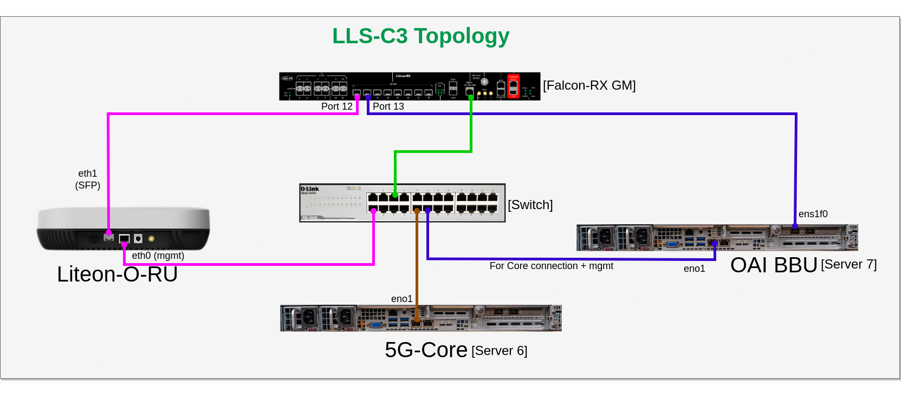
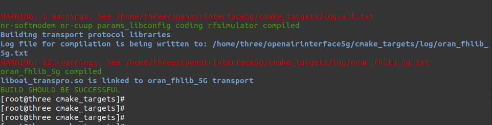

<table style="border-collapse: collapse; border: none;">
  <tr style="border-collapse: collapse; border: none;">
    <td style="border-collapse: collapse; border: none;">
      <a href="http://ngkore.com/">
         
         </img>
      </a>
    </td>
    <td style="border-collapse: collapse; border: none; vertical-align: center;">
      <b><font size = "5">Liteon-ngKore 7.2 5G SA Tutorial (fhidriver_E branch) </font></b>
    </td>
  </tr>
</table>

**Table of Contents**
1. [Hardware Info](#1-hardware-info)
2. [Real-Time Kernel](#2-real-time-kernel)
3. [CPU allocation & Grub Update](#3-cpu-allocation--grub-update)
4. [Required Package Installation](#4-required-package-installation)
- 4.1. [gcc-11 installation](#41-gcc-11-installation)
- 4.2. [Install meson and other additional packages](#42-install-meson-and-other-additional-packages)
- 4.3. [Install required libraries for RAN build](#43-install-required-libraries-for-ran-build)
- 4.4. [Install ninja](#44-install-ninja)
5. [SCTP installation](#5-sctp-installation)
6. [DPDK(Data Plane Development Kit) 20.11.7](#6-dpdkdata-plane-development-kit-20117)
7. [OSC-PHY installation](#7-osc-phy-installation)
8. [Build OAI gNB](#8-build-oai-gnb)
9. [Linux PTP installation](#9-linux-ptp-installation)
10. [Bind devices](#10-bind-devices)
11. [Configure Server and OAI gNB](#11-configure-server-and-oai-gnb)
12. [Cpu Frequency Adjustment](#12-cpu-frequency-adjustment)
13. [5G Core deployment](#14-run-oai-gnb)
14. [Run OAI gNB](#14-run-oai-gnb)
15. [O-RU commands](#15-o-ru-commands)

  
# 1. Hardware Info
The hardware on which we have tried this tutorial:

### 2 NUMA Node system i.e server `two`

|Hardware (CPU,RAM)                          |Operating System (kernel)                  |NIC (Vendor,Driver)                     | Server Number |
|--------------------------------------------|----------------------------------|-------------------------------------------------|------|
| Intel(R) Xeon(R) Gold 6330, 56-Core, 2 nodes | RHEL 8.7 (with rtk installed) | Intel X710 for 10GbE SFP+,i40e | server 2 |

For further hardware info check out this file: [HW-info-NUMA-2](./hwinfo_2_NUMA.txt)

### 1 NUMA Node system i.e server `seven`

|Hardware (CPU,RAM)                          |Operating System (kernel)                  |NIC (Vendor,Driver)                     | Server Number |
|--------------------------------------------|----------------------------------|-------------------------------------------------|------|
| Intel(R) Xeon(R) Gold 6354, 18-Core, 1 nodes | RHEL 8.7 (with rtk installed) | Intel XXV710 for 10GbE SFP+,i40e | server 7 |

For further hardware info check out this file: [HW-info-NUMA-1](./hwinfo_1_NUMA.txt)

## BIOS settings:

* Turbo boost should be ON
* CPU Enhanced Halt State or C1E should be DISABLED
* Hyper-Threading should be OFF
* SRIOV should be ENABLED

# 2. Real-Time Kernel

Install the real time kernel after the fresh OS installation.

```bash
git clone https://github.com/NgKore47/Liteon-ngKore_E.git
cd Liteon-ngKore_E/
sudo bash ./rhel-packages/rtk.sh
```

* After the reboot checkout the kernel version using following commands:
```bash
uname -a
```
It will show something like this:

```bash
[two@two ~]$ uname -a
Linux two 4.18.0-477.27.1.rt7.290.el8_8.x86_64 #1 SMP PREEMPT_RT Thu Aug 31 10:40:44 EDT 2023 x86_64 x86_64 x86_64 GNU/Linux
```

Change the boot order, if rtk does open by default: Use the following command for that:
```bash
sudo grub2-set-default 0
```

Update all the packages now:

```bash
sudo yum update -y
```
These will update the packages and also change the os-version to 8.8

```bash
cat /etc/os-release
```

# 3. CPU allocation & Grub Update

**This section is important to read, regardless of the operating system you are using.**

Your server could be:

* 1-socket CPU : all the processors are sharing a single memory system.

* 2-socket CPU : processors are grouped in 2 memory systems.

* DPDK, OAI and kernel threads require to be properly allocated to extract maximum real-time performance for your use case.


* Currently the default OAI 7.2 configuration file requires isolated CPUs 0,2,4 for DPDK/libXRAN, 

* CPU 6 for ru_thread and CPU 8 for L1_rx_thread. 

> It is preferrable to have all these threads on the same socket.

* Allocating CPUs to the nr-softmodem is done using the --thread-pool option. 

* Allocating 4 CPUs is the minimal configuration but we recommend to allocate at least 8 CPUs. And they can be on a different socket as the DPDK threads.
And to avoid kernel preempting these allocated CPUs, it is better to force the kernel to use un-allocated CPUs.

Let summarize for example on a 32-CPU system, regardless of the number of sockets:

### For one socket system i.e 1 NUMA Node
|Applicative Threads  | Allocated CPUs   |
|---------------------|------------------|
| XRAN DPDK usage     | 0,2,4            |
| OAI ru_thread       | 6                |
| OAI L1_rx_thread    | 8                |
| nr-softmodem        | 9,10,11,12,13,14,15    |
| kernel              | 16-17           |

> Note: In our case we have `18` cores
```
NUMA node0 CPU(s):   0-17
```
Copy the below arguements and paste it in the `/etc/default/grub` file.

```bash
igb.max_vfs=2 intel_iommu=on iommu=pt mitigations=off cgroup_memory=1 cgroup_enable=memory mce=off idle=poll hugepagesz=1G hugepages=40 hugepagesz=2M hugepages=0 default_hugepagesz=1G selinux=0 enforcing=0 nmi_watchdog=0 softlockup_panic=0 audit=0 skew_tick=1 rcu_nocb_poll cgroup_disable=memory kthread_cpus=16-17 skew_tick=1 isolcpus=managed_irq,domain,0-8 nohz_full=0-8 rcu_nocbs=0-8 intel_pstate=disable nosoftlockup tsc=nowatchdog
```
> **OR**

### For two socket system i.e 2 NUMA Node
|Applicative Threads  | Allocated CPUs   |
|---------------------|------------------|
| XRAN DPDK usage     | 0,2,4            |
| OAI ru_thread       | 6                |
| OAI L1_rx_thread    | 8                |
| nr-softmodem        | 30,31,32,33,34,35,36,36,37 |
| kernel              | 9-27,38-55       |

> Note: In our case we have `56` cores
```
NUMA node0 CPU(s):   0-27
NUMA node1 CPU(s):   28-55
```
Copy the below arguements and paste it in the `/etc/default/grub` file.

```bash
igb.max_vfs=2 intel_iommu=on iommu=pt mitigations=off cgroup_memory=1 cgroup_enable=memory mce=off idle=poll hugepagesz=1G hugepages=40 hugepagesz=2M hugepages=0 default_hugepagesz=1G selinux=0 enforcing=0 nmi_watchdog=0 softlockup_panic=0 audit=0 skew_tick=1 rcu_nocb_poll cgroup_disable=memory kthread_cpus=9-27,38-55 skew_tick=1 isolcpus=managed_irq,domain,0-8 nohz_full=0-8 rcu_nocbs=0-8 intel_pstate=disable nosoftlockup tsc=nowatchdog
```


```bash
sudo vim /etc/default/grub
```
and paste it under `GRUB_CMDLINE_LINUX` part.

It will look something like this:

```bash
[root@two two]# cat /etc/default/grub 

GRUB_TIMEOUT=5
GRUB_DISTRIBUTOR="$(sed 's, release .*$,,g' /etc/system-release)"
GRUB_DEFAULT=saved
GRUB_DISABLE_SUBMENU=true
GRUB_TERMINAL_OUTPUT="console"
GRUB_CMDLINE_LINUX="crashkernel=auto resume=/dev/mapper/rhel-swap rd.lvm.lv=rhel/root rd.lvm.lv=rhel/swap rhgb quiet igb.max_vfs=2 intel_iommu=on iommu=pt mitigations=off cgroup_memory=1 cgroup_enable=memory mce=off idle=poll hugepagesz=1G hugepages=40 hugepagesz=2M hugepages=0 default_hugepagesz=1G selinux=0 enforcing=0 nmi_watchdog=0 softlockup_panic=0 audit=0 skew_tick=1 rcu_nocb_poll cgroup_disable=memory kthread_cpus=9-27,38-55 skew_tick=1 isolcpus=managed_irq,domain,0-8 nohz_full=0-8 rcu_nocbs=0-8 intel_pstate=disable nosoftlockup tsc=nowatchdog"
GRUB_DISABLE_RECOVERY="true"
GRUB_ENABLE_BLSCFG=true
```
> NOTE: In grub, make sure to give specific cores to `kthread_cpus` in `GRUB_CMDLINE_LINUX` based on the system.

grub update

```bash
sudo grub2-mkconfig -o /boot/grub2/grub.cfg
```

Change the kernel order to rtk before rebooting:

```bash
sudo grub2-set-default 0
```
Reboot
```bash
sudo reboot
```

After rebooting turn on th real time profile:

```bash
tuned-adm profile realtime
```

Now check whether 40 hugepages are created or not:
```bash
grep HugePages /proc/meminfo
```

# 4. Required Package Installation

## 4.1 gcc-11 installation
```bash
sudo yum remove --skip-broken gcc -y
sudo yum install gcc-toolset-11 -y
```

Use gcc-11 toolset
```bash
sudo scl enable gcc-toolset-11 bash
```
Now install everything inside this gcc-11 env

Check the gcc and g++ version
```bash
[root@two two]# gcc -v

Using built-in specs.
COLLECT_GCC=gcc
COLLECT_LTO_WRAPPER=/opt/rh/gcc-toolset-11/root/usr/libexec/gcc/x86_64-redhat-linux/11/lto-wrapper
OFFLOAD_TARGET_NAMES=nvptx-none
OFFLOAD_TARGET_DEFAULT=1
Target: x86_64-redhat-linux
Configured with: ../configure --enable-bootstrap --enable-languages=c,c++,fortran,lto --prefix=/opt/rh/gcc-toolset-11/root/usr --mandir=/opt/rh/gcc-toolset-11/root/usr/share/man --infodir=/opt/rh/gcc-toolset-11/root/usr/share/info --with-bugurl=http://bugzilla.redhat.com/bugzilla --enable-shared --enable-threads=posix --enable-checking=release --enable-multilib --with-system-zlib --enable-__cxa_atexit --disable-libunwind-exceptions --enable-gnu-unique-object --enable-linker-build-id --with-gcc-major-version-only --with-linker-hash-style=gnu --enable-plugin --enable-initfini-array --with-isl=/builddir/build/BUILD/gcc-11.2.1-20220127/obj-x86_64-redhat-linux/isl-install --enable-offload-targets=nvptx-none --without-cuda-driver --enable-gnu-indirect-function --enable-cet --with-tune=generic --with-arch_32=x86-64 --build=x86_64-redhat-linux
Thread model: posix
Supported LTO compression algorithms: zlib zstd
gcc version 11.2.1 20220127 (Red Hat 11.2.1-9) (GCC)
```

* Clone this repo and Install other dependencies

```bash
bash ./rhel-packages/install_group_8.sh
```
## 4.2 Install meson and other additional packages

```bash
bash ./rhel-packages/py_meson.sh
bash ./rhel-packages/additional_8.sh
bash ./rhel-packages/numa.sh
```
## 4.3 Install required libraries for RAN build:

```bash
bash ./rhel-packages/dependency_lib_8.sh
```

## 4.4 Install ninja

```bash
bash ./rhel-packages/install_ninja.sh
```

# 5. SCTP installation

```bash
sudo yum install kernel-modules-extra-4.18.0-477.27.1.el8_8.x86_64 -y
```
```bash
yum install -y lksctp-tools lksctp-tools-devel lksctp-tools-doc
```
Add `sctp` to `/etc/modules-load.d/` to load sctp before systemd-sysctl.service during boot. Loading sctp before systemd-sysctl.service allows the sctp sysctl.conf settings to be effective

```
# cat /etc/modules-load.d/sctp.conf
sctp
```

sctp is blacklisted by default on installation. Comment out the blacklisting to enable sctp to be loaded.

```
# grep sctp /etc/modprobe.d/*
/etc/modprobe.d/sctp-blacklist.conf:#blacklist sctp
/etc/modprobe.d/sctp_diag-blacklist.conf:#blacklist sctp_diag
```

```bash
modprobe sctp
```

Check whether the module is loaded 
```bash
lsmod | grep sctp
```
Verify SCTP supported or not.

```bash
checksctp
```


# 6. DPDK(Data Plane Development Kit) 20.11.7

```bash
wget http://fast.dpdk.org/rel/dpdk-20.11.7.tar.xz
tar xvf dpdk-20.11.7.tar.xz && cd dpdk-stable-20.11.7
/usr/local/bin/meson build
ninja -C build
sudo ninja install -C build
```
> Note: DPDK build process will take a good time to complete. While building it will also show some message like: 
> `NOTICE: You are using Python 3.6 *ich is EOL. Starting with ve.62.ø, Meson will require Python 3.7 or newer`. 
> Ignore this message and proceed further.

After DPDK has been built successfully, execute the following commands.

```bash
sudo echo "/usr/local/lib" > /etc/ld.so.conf.d/local-lib.conf
sudo echo "/usr/local/lib64" >> /etc/ld.so.conf.d/local-lib.conf
sudo ldconfig -v | grep rte_
```
export the following path

```bash
export PKG_CONFIG_PATH=$PKG_CONFIG_PATH:/usr/local/lib64/pkgconfig/
pkg-config --libs libdpdk --static
```

the above command should give the following output:

```bash
[root@two rhel-packages]# pkg-config --libs libdpdk --static

-Wl,--whole-archive -L/usr/local/lib64 -l:librte_common_cpt.a -l:librte_common_dpaax.a -l:librte_common_iavf.a -l:librte_common_octeontx.a -l:librte_common_octeontx2.a -l:librte_common_sfc_efx.a -l:librte_bus_dpaa.a -l:librte_bus_fslmc.a -l:librte_bus_ifpga.a -l:librte_bus_pci.a -l:librte_bus_vdev.a -l:librte_bus_vmbus.a -l:librte_common_qat.a -l:librte_mempool_bucket.a -l:librte_mempool_dpaa.a -l:librte_mempool_dpaa2.a -l:librte_mempool_octeontx.a -l:librte_mempool_octeontx2.a -l:librte_mempool_ring.a -l:librte_mempool_stack.a -l:librte_net_af_packet.a -l:librte_net_ark.a -l:librte_net_atlantic.a -l:librte_net_avp.a -l:librte_net_axgbe.a -l:librte_net_bond.a -l:librte_net_bnx2x.a -l:librte_net_bnxt.a -l:librte_net_cxgbe.a -l:librte_net_dpaa.a -l:librte_net_dpaa2.a -l:librte_net_e1000.a -l:librte_net_ena.a -l:librte_net_enetc.a -l:librte_net_enic.a -l:librte_net_failsafe.a -l:librte_net_fm10k.a -l:librte_net_i40e.a -l:librte_net_hinic.a -l:librte_net_hns3.a -l:librte_net_iavf.a -l:librte_net_ice.a -l:librte_net_igc.a -l:librte_net_ixgbe.a -l:librte_net_kni.a -l:librte_net_liquidio.a -l:librte_net_memif.a -l:librte_net_netvsc.a -l:librte_net_nfp.a -l:librte_net_null.a -l:librte_net_octeontx.a -l:librte_net_octeontx2.a -l:librte_net_pfe.a -l:librte_net_qede.a -l:librte_net_ring.a -l:librte_net_sfc.a -l:librte_net_softnic.a -l:librte_net_tap.a -l:librte_net_thunderx.a -l:librte_net_txgbe.a -l:librte_net_vdev_netvsc.a -l:librte_net_vhost.a -l:librte_net_virtio.a -l:librte_net_vmxnet3.a -l:librte_raw_dpaa2_cmdif.a -l:librte_raw_dpaa2_qdma.a -l:librte_raw_ioat.a -l:librte_raw_ntb.a -l:librte_raw_octeontx2_dma.a -l:librte_raw_octeontx2_ep.a -l:librte_raw_skeleton.a -l:librte_crypto_bcmfs.a -l:librte_crypto_caam_jr.a -l:librte_crypto_ccp.a -l:librte_crypto_dpaa_sec.a -l:librte_crypto_dpaa2_sec.a -l:librte_crypto_nitrox.a -l:librte_crypto_null.a -l:librte_crypto_octeontx.a -l:librte_crypto_octeontx2.a -l:librte_crypto_openssl.a -l:librte_crypto_scheduler.a -l:librte_crypto_virtio.a -l:librte_compress_octeontx.a -l:librte_compress_zlib.a -l:librte_regex_octeontx2.a -l:librte_vdpa_ifc.a -l:librte_event_dlb.a -l:librte_event_dlb2.a -l:librte_event_dpaa.a -l:librte_event_dpaa2.a -l:librte_event_octeontx2.a -l:librte_event_opdl.a -l:librte_event_skeleton.a -l:librte_event_sw.a -l:librte_event_dsw.a -l:librte_event_octeontx.a -l:librte_baseband_null.a -l:librte_baseband_turbo_sw.a -l:librte_baseband_fpga_lte_fec.a -l:librte_baseband_fpga_5gnr_fec.a -l:librte_baseband_acc100.a -l:librte_node.a -l:librte_graph.a -l:librte_bpf.a -l:librte_flow_classify.a -l:librte_pipeline.a -l:librte_table.a -l:librte_port.a -l:librte_fib.a -l:librte_ipsec.a -l:librte_vhost.a -l:librte_stack.a -l:librte_security.a -l:librte_sched.a -l:librte_reorder.a -l:librte_rib.a -l:librte_regexdev.a -l:librte_rawdev.a -l:librte_pdump.a -l:librte_power.a -l:librte_member.a -l:librte_lpm.a -l:librte_latencystats.a -l:librte_kni.a -l:librte_jobstats.a -l:librte_ip_frag.a -l:librte_gso.a -l:librte_gro.a -l:librte_eventdev.a -l:librte_efd.a -l:librte_distributor.a -l:librte_cryptodev.a -l:librte_compressdev.a -l:librte_cfgfile.a -l:librte_bitratestats.a -l:librte_bbdev.a -l:librte_acl.a -l:librte_timer.a -l:librte_hash.a -l:librte_metrics.a -l:librte_cmdline.a -l:librte_pci.a -l:librte_ethdev.a -l:librte_meter.a -l:librte_net.a -l:librte_mbuf.a -l:librte_mempool.a -l:librte_rcu.a -l:librte_ring.a -l:librte_eal.a -l:librte_telemetry.a -l:librte_kvargs.a -Wl,--no-whole-archive -Wl,--export-dynamic -Wl,--as-needed -lrte_node -lrte_graph -lrte_bpf -lrte_flow_classify -lrte_pipeline -lrte_table -lrte_port -lrte_fib -lrte_ipsec -lrte_vhost -lrte_stack -lrte_security -lrte_sched -lrte_reorder -lrte_rib -lrte_regexdev -lrte_rawdev -lrte_pdump -lrte_power -lrte_member -lrte_lpm -lrte_latencystats -lrte_kni -lrte_jobstats -lrte_ip_frag -lrte_gso -lrte_gro -lrte_eventdev -lrte_efd -lrte_distributor -lrte_cryptodev -lrte_compressdev -lrte_cfgfile -lrte_bitratestats -lrte_bbdev -lrte_acl -lrte_timer -lrte_hash -lrte_metrics -lrte_cmdline -lrte_pci -lrte_ethdev -lrte_meter -lrte_net -lrte_mbuf -lrte_mempool -lrte_rcu -lrte_ring -lrte_eal -lrte_telemetry -lrte_kvargs -pthread -lm -ldl -lcrypto -ldl -pthread -lz -lelf -lz
```


# 7. OSC-PHY installation

```bash
git clone https://github.com/NgKore47/liteon-phy.git
cd liteon-phy
git checkout oran_e_maintenance_release_v1.0
# git apply phy_final.patch
```
> **Note:** In this liteon-phy repo, the patch file is already applied. You need not to apply it again.


### Export the the path:
```bash
export XRAN_LIB_DIR=/home/$(hostname)/phy/fhi_lib/lib/build
export XRAN_DIR=/home/$(hostname)/phy/fhi_lib
export RTE_SDK=/home/$(hostname)/dpdk-stable-20.11.7
export RTE_TARGET=x86_64-native-linuxapp-gcc
export RTE_INCLUDE=/usr/local/include
```

### FHI build
```bash
cd phy/fhi_lib/lib
make XRAN_LIB_SO=1
```

#### Output will show something like this:
```
[AR] build/libxran.so
./build/libxran.so
GTEST_ROOT is not set. Unit tests are not compiled
"echo "GTEST_ROOT is not set. Unit tests are not compiled"" command exited with code 0.
```

# 8. Build OAI gNB

### Build OAI
```bash
cd Liteon-ngKore_E/cmake_targets/
./build_oai  --gNB --ninja -t oran_fhlib_5g -I
```


### Copy the `libxran.xo`
```bash
sudo cp /home/$(hostname)/phy/fhi_lib/lib/build/libxran.so /usr/local/lib
sudo cp /home/$(hostname)/phy/fhi_lib/lib/build/libxran.so /home/$(hostname)/Liteon-ngKore_E/cmake_targets/ran_build/build
```

# 9. Linux PTP installation

For this tutorial we are using `Fibrolan Falcon-Rx` C1 & C3 both can be used.<br>
While using C1: `ens1f1` is connected with Fibrolan and `ens1f0` is directly connected with Liteon O-RU.<br>
While using C3 `ens1f0` is connected with Fibrolan. <br>
Here `ens1f0` is the interface of DU server.

> **NOTE:** <br> 
> Generally, in `C1`,  *RU --- DU --- PTP*  i.e `RU` is directly connected to `DU` and `DU` is connected to clock source(`Fibrolan`).<br>
> But in `C3`,   *RU --- PTP --- DU*  i.e `RU` is directly connected to clock source(`Fibrolan`) and then clock source is connected to `DU`.

```bash
git clone https://github.com/NgKore47/linuxptp.git
```
### Build linuxptp:
```bash
cd linuxptp
sudo make 
sudo make install
```

### Run `ptp4l` & `phc2sys` using linuxptp
#### For C1

```bash
sudo ./ptp4l -i ens1f1 -m -H -2 -s -f configs/c1.cfg
sudo ./phc2sys -w -m -s ens1f1 -R 8 -f configs/c1.cfg
sudo ./ptp4l -i ens1f0 -m -H -2 -f configs/c1.cfg
```
#### For C3

```bash
sudo ./ptp4l -i ens1f0 -m -H -2 -s -f configs/default.cfg
sudo ./phc2sys -w -m -s ens1f0 -R 8 -f configs/default.cfg
```
> **Note:** Use specific interface name in place of `ens1f0`, based on your system.

# 10. Bind devices
**Note:** Same interface `ens1f0` will be used here.

> **NOTE:**  You must be super-user

```bash
echo "0" > /sys/class/net/ens1f0/device/sriov_numvfs
echo "2" > /sys/class/net/ens1f0/device/sriov_numvfs
sudo ip link set ens1f0 vf 0 mac 00:11:22:33:44:66 vlan 564 spoofchk off trust on 
sudo ip link set ens1f0 vf 1 mac 00:11:22:33:44:66 vlan 564 spoofchk off trust on
modprobe vfio_pci
```

> **NOTE:** Check the PCI address of the virtual functions and change it accordingly, in this case it is: `0000:31:02.0` & `0000:31:02.1`

```bash
sudo /usr/local/bin/dpdk-devbind.py -s
sudo /usr/local/bin/dpdk-devbind.py --bind vfio-pci 0000:31:02.0
sudo /usr/local/bin/dpdk-devbind.py --bind vfio-pci 0000:31:02.1
sudo ifconfig ens1f0 mtu 1500
sudo ethtool -G ens1f0 rx 4096 tx 4096
```
# 11. Configure Server and OAI gNB

### Copy important files needed for running `nr-softmodem` cmd
```
cd /home/$(hostname)/Liteon-ngKore_E/rhel-packages/modified_oai_serv2
cp config_o_du_3450_E.dat mwc_20899_newfhi_E_3450.conf usecase_du_3450.cfg ../../cmake_targets/ran_build/build/
```

### Check the following this in the `mwc_20899_newfhi_E_3450.conf` file
* The `PLMN` section shall match the one defined in the AMF

* `amf_ip_address` shall be the correct AMF IP address in your system i.e. `192.168.70.132` for OAI-Core

* `GNB_INTERFACE_NAME_FOR_NG_AMF` and `GNB_IPV4_ADDRESS_FOR_NG_AMF` shall match your DU N2 interface name and IP address

* `GNB_INTERFACE_NAME_FOR_NGU` and `GNB_IPV4_ADDRESS_FOR_NGU` shall match your DU N3 interface name and IP address

* Adjust the `frequency`, `bandwidth` and `SSB` position

* Set an isolated core for L1 thread `L1_rx_thread_core` in our environment we are using CPU 8

* Set an isolated core for RU thread `ru_thread_core` in our environment we are using CPU 6

* `phase_compensation` should be set to 0 to disable when it is performed in the RU and set to 1 when it should be performed on the DU side

* `sdr_addrs = "dummy --usecasefile /home/two/Liteon-ngKore_E/cmake_targets/ran_build/build/usecase_du_3450.cfg --num_eth_vfs 2 --vf_addr_o_xu_a \"0000:31:02.0,0000:31:02.1\""`. Here change the hostname and pic address fo vfs according to your server.

> **NOTE:** On our system, the ~ folder corresponds to /home/two

The fact that we are providing an absolute path to the O-RAN FHI configuration dat file makes it easier to manage.


### Adapt the O-RAN fronthaul interface configuration dat file to your system:

##### Checkout the following fields in the `config_o_du_3450_E.dat` file at `/home/two/Liteon-ngKore_E/rhel-packages`
* ruMac0
* ruMac1

##### Set the following things:

* c_plane_vlan_tag
* u_plane_vlan_tag
* mtu

##### Set the cores for DPDK

* systemCore (absolute coreId)
* ioWorker (it is a mask: 1<<coreid) (For example if you select core 2 then this value should be 4)
* ioCore (absolute coreId)

##### Adjust the frequency, bandwidth and any other parameter which is relevant to your environment.

## 12. Cpu Frequency Adjustment:

Set the cpu on maximum frequency:

```bash
sudo cpupower frequency-set -g performance
sudo cpupower idle-set -D 0
```

In this server 3.1 GHz is the max freq that cpu supports


```bash
sudo cpupower frequency-set -u 3100000
sudo cpupower frequency-set -d 3100000
```

> **NOTE:** After doing the whole tests, set the frequency to default values by running the following commands.

```bash
sudo cpupower frequency-set --governor powersave
sudo cpupower frequency-set --min 800MHz --max 3.10GHz
sudo cpupower idle-set -E
```

> **NOTE:** This system supports minimum 800 MHz frequency <br>
> You can also see the current frequency using: `cpupower frequency-info `<br>
> Also to see temprature of system use: `sensors`

# 13. 5G Core deployment

For 5G core deployment refer this repo:
[Ngkore-CN5G](https://github.com/NgKore47/Ngkore-CN5G.git)

In other server 5G core should be running

For giving path to the 5G core Server, execute the following command:

```bash
sudo ip route add 192.168.70.128/26 via 192.168.1.185 dev enp177s0f0 
```
where  `enp177s0f0` is the interface of this system which will be connected to the 5G Core and `192.168.1.185` is the ip of the server on which 5G Core is running.

# 14. Run OAI gNB

```bash
cd ~/Liteon-ngKore_E/cmake_targets/ran_build/build/
# For 1 NUMA Node system
sudo LD_LIBRARY_PATH=.:/usr/local/lib64 ./nr-softmodem -O mwc_20899_newfhi_E_3450.conf --sa --reorder-thread-disable 1 --thread-pool 9,10,11,12,13,14,15

# For 2 NUMA Node system
sudo LD_LIBRARY_PATH=.:/usr/local/lib64 ./nr-softmodem -O mwc_20899_newfhi_E_3450.conf --sa --reorder-thread-disable 1 --thread-pool 30,31,32,33,34,35,36,36,37
```
> **NOTE:** Make sure to change the cores according to your server specs.

The logs should be something like this: [nr-softmodem](./logs/nr-softmodem_logs.log)

# 15. O-RU commands

After every reboot of RU, run the following commands:

> **NOTE:** Prefer not to copy and paste these commands

```bash
devmem 0x80001014 32 0x00030002
devmem 0x80001018 32 0x00010000 
devmem 0x8000201C 32 0x00000001
```

